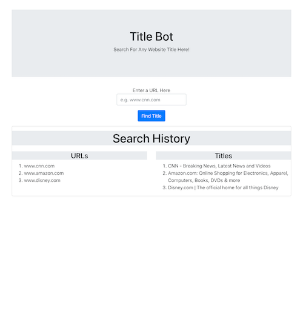

# Title Bot

## Description

This application allows you to search for any website title with a valid URL.

`Click this URL for the deployed appliation:` https://title-bot.herokuapp.com/

## Table of Contents

- [Installation](#installation)
- [License](#license)
- [Questions](#questions)

## Installation

- While in the root directory, run: `npm install`
- After all installations complete, run: `npm start`
- View the app running on <http://localhost:3000>

## License

## Questions

For any additional questions, please send me an e-mail at jackson.meier423@gmail.com

Link to my GitHub: https://github.com/meierj423
